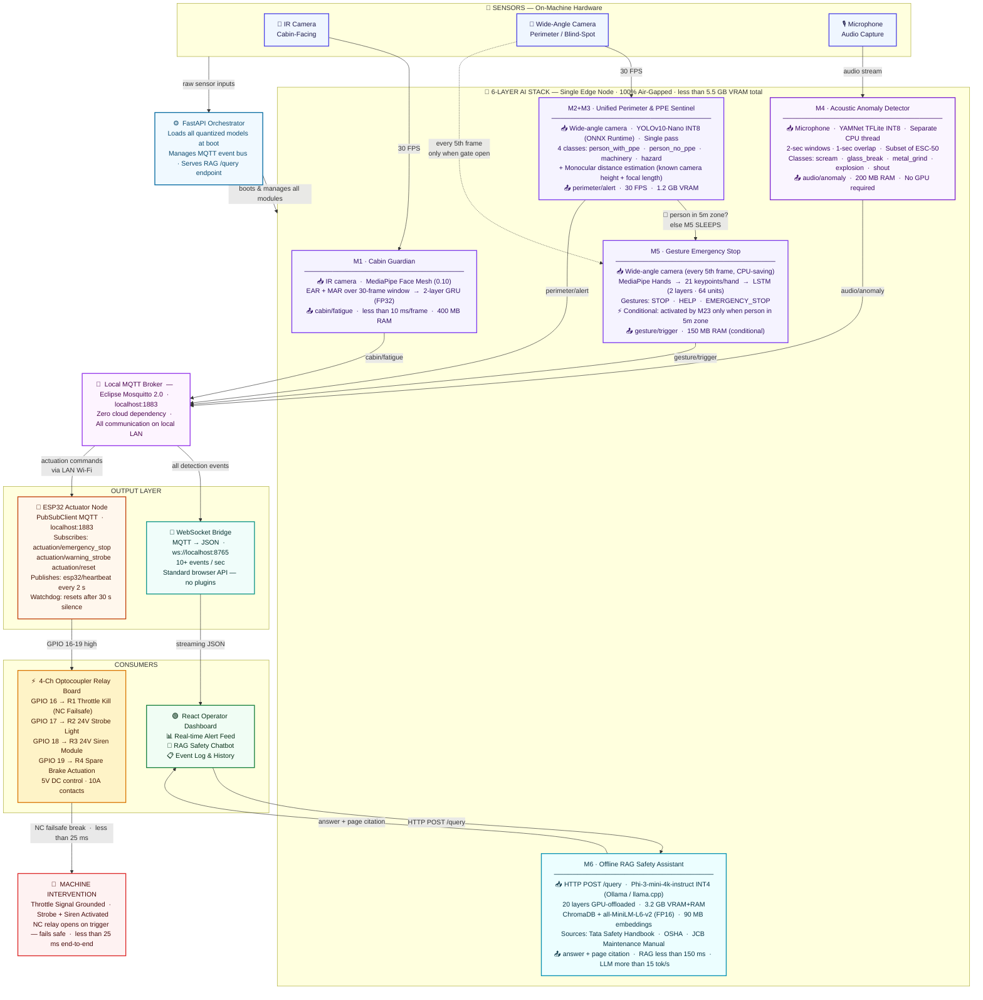

# SafeSite-Edge Pro – System Architecture

> **Tata Technologies InnoVent Hackathon** · Track: Edge AI for Operator Safety & Human–Machine Interaction

---



---

## 📊 Performance Metrics at a Glance

| Module | Technology Stack | Quantization | Latency | Memory |
|--------|-----------------|-------------|---------|--------|
| **M1 · Cabin Guardian** | MediaPipe Face Mesh 0.10 + PyTorch GRU | FP32 (CPU) | <10 ms / frame | 400 MB RAM |
| **M2+M3 · Perimeter & PPE** | YOLOv10-Nano (ONNX Runtime) | INT8 | ≤25 ms/frame @ 30 FPS | **1.2 GB VRAM** |
| **M4 · Acoustic Anomaly** | YAMNet TFLite (MobileNet-v1) | INT8 | 2-sec sliding window | 200 MB RAM |
| **M5 · Gesture Stop** | MediaPipe Hands + TensorFlow LSTM | FP32 (CPU) | Conditional (sleeps when idle) | 150 MB RAM |
| **M6 · Embeddings** | Sentence-Transformers all-MiniLM-L6-v2 | FP16 | <150 ms retrieval | 90 MB RAM |
| **M6 · LLM Inference** | Phi-3-mini-4k-instruct-q4 (Ollama/llama.cpp) | INT4 (GGUF) | >15 tokens/sec | 3.2 GB VRAM+RAM |
| **ESP32 Actuation** | PubSubClient MQTT → NC Relay | – | **<25 ms end-to-end** | 4 MB Flash |
| **🔋 Total System** | All 6 modules concurrent | Mixed | – | **<5.5 GB VRAM** |

---

## 🔑 Architecture Optimisations (For Judges Q&A)

| Judge Concern | Engineering Solution |
|---------------|---------------------|
| "Running YOLO twice for PPE and perimeter is too slow." | A single **YOLOv10-Nano** is fine-tuned on 4 custom classes — PPE status and perimeter hazards detected in **one unified pass**. No weight swapping, no frame drops. |
| "MediaPipe Hands will constantly burn CPU." | M5 uses a **conditional activation gate** driven by M2+M3. If no person is inside the 5 m boundary zone, the gesture module never wakes — zero CPU overhead. |
| "React needs a MQTT browser plugin." | A **WebSocket proxy bridge** translates all MQTT events into clean JSON streamed over a single WS endpoint (`ws://localhost:8765`). Standard `WebSocket` API, no plugins. |
| "Can you really run an LLM + CV on one laptop?" | **Phi-3-mini INT4** uses 3.2 GB; **YOLO INT8** uses 1.2 GB. `llama.cpp` GPU-offloads 20 layers while YOLO runs concurrently. Total peak: <5.5 GB on RTX 3060. |
| "How do you guarantee physical actuation in remote mines?" | ESP32 connects to a **local Mosquitto broker** over LAN. Relay contacts interface directly with the machine throttle circuit. Zero internet, zero cloud. |
| "What if connectivity is completely lost?" | The system is **100% air-gapped**. All communication is local Ethernet/Wi-Fi between the edge node and ESP32 actuators — works underground. |
| "What if the ESP32 loses MQTT connection?" | A hardware **watchdog timer** resets the ESP32 if no MQTT keep-alive is received in 30 seconds, restoring the NC relay's fail-safe open state automatically. |

---

## 🔁 Data Flow Summary

```
Sensors ──► Orchestrator ──► AI Stack ──► MQTT Broker ──► WebSocket Bridge ──► React Dashboard
                                                    │                                   ↕ RAG
                                                    └──► ESP32 Actuator ──► 4-Ch Relay ──► Machine
```

> All communication is **local-only**. The edge node, MQTT broker, ESP32, and React dashboard share a single air-gapped LAN — operable in underground mines, remote construction sites, and any environment with zero connectivity.
